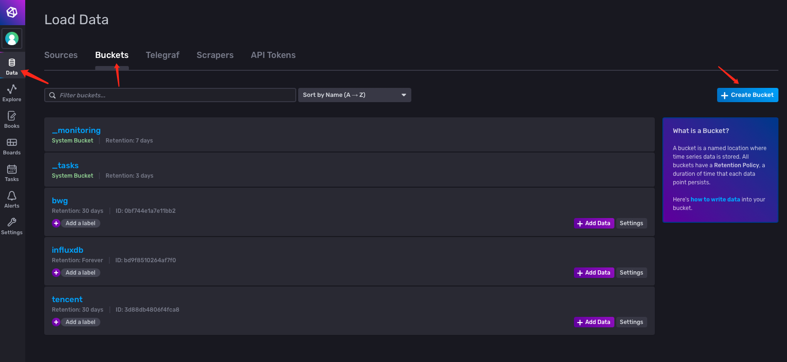
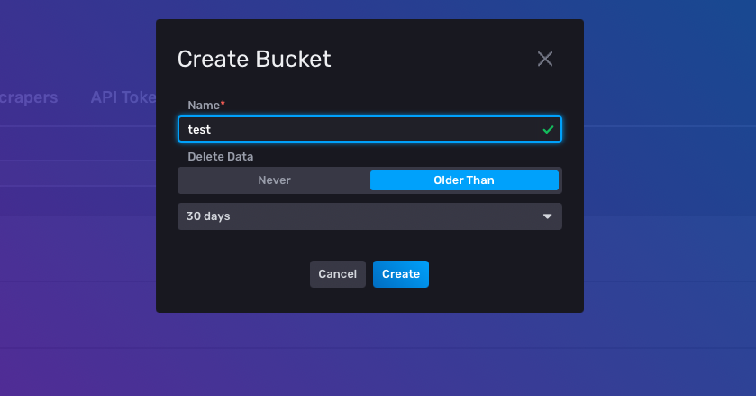
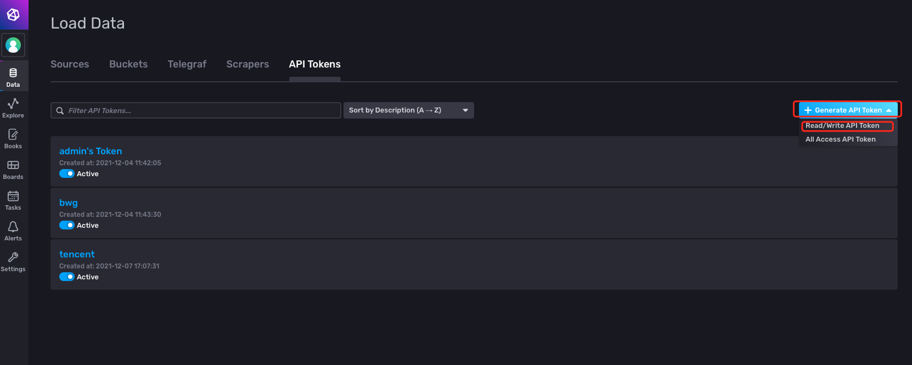
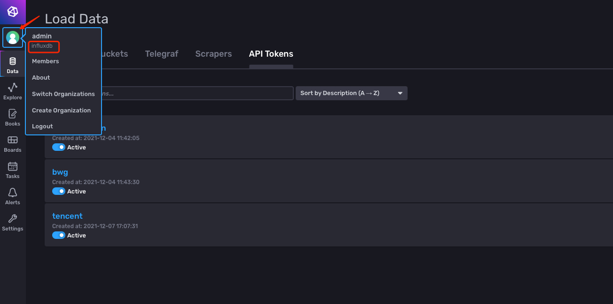

### 安装 influxdb

参考文档 https://portal.influxdata.com/downloads/

注意： 本项目仅支持 influxdb 2.x 版本

### 创建influxdb bucket 与 token







### 获取influxdborg



### 申请腾讯云访问秘钥

获取安全凭证。安全凭证包含 SecretId 及 SecretKey 两部分。SecretId 用于标识 API 调用者的身份，SecretKey 用于加密签名字符串和服务器端验证签名字符串的密钥。前往 [API 密钥管理](https://console.cloud.tencent.com/cam/capi) 页面，即可进行获取，如下图所示：


### region对照表
| 地区     | 地区代号         |
| -------- | ---------------- |
| 曼谷     | ap-bangkok       |
| 北京     | ap-beijing       |
| 成都     | ap-chengdu       |
| 重庆     | ap-chongqing     |
| 广州     | ap-guangzhou     |
| 中国香港 | ap-hongkong      |
| 孟买     | ap-mumbai        |
| 首尔     | ap-seoul         |
| 上海     | ap-shanghai      |
| 南京     | ap-nanjing       |
| 新加坡   | ap-singapore     |
| 东京     | ap-tokyo         |
| 法兰克福 | eu-frankfurt     |
| 莫斯科   | eu-moscow        |
| 阿什本   | na-ashburn       |
| 硅谷     | na-siliconvalley |
| 多伦多   | na-toronto       |


### 配置文件

路径 conf/config.yaml

```yaml
influxdbtoken: 
influxdburl: 
influxdbbucket: 
influxdborg: 
lighthouse:
  - secretid: 
    secretkey: 
    regions:
      - region: ap-shanghai
      - region: ap-beijing
```

